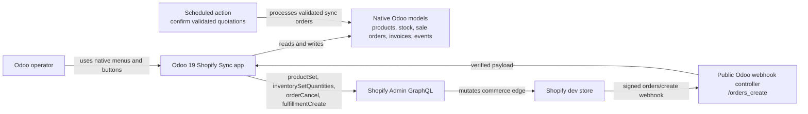
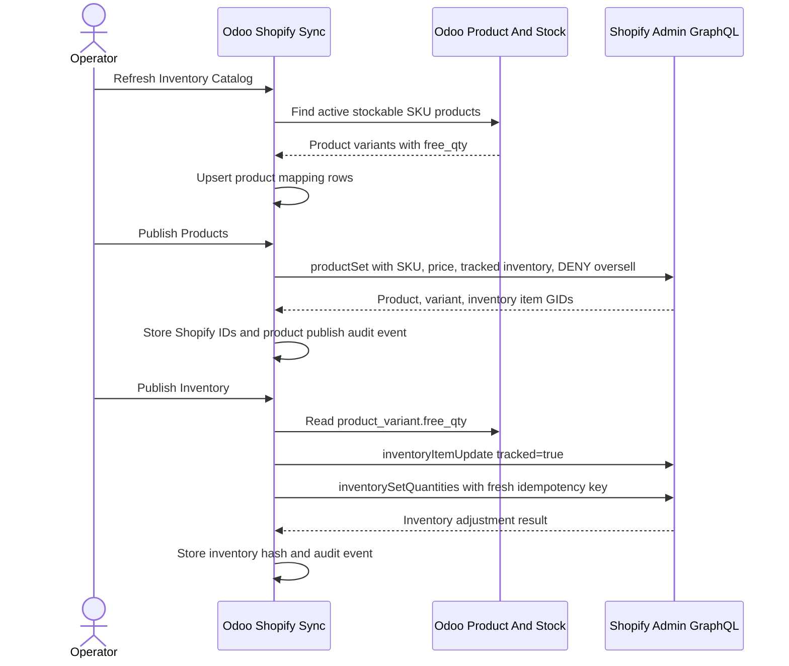
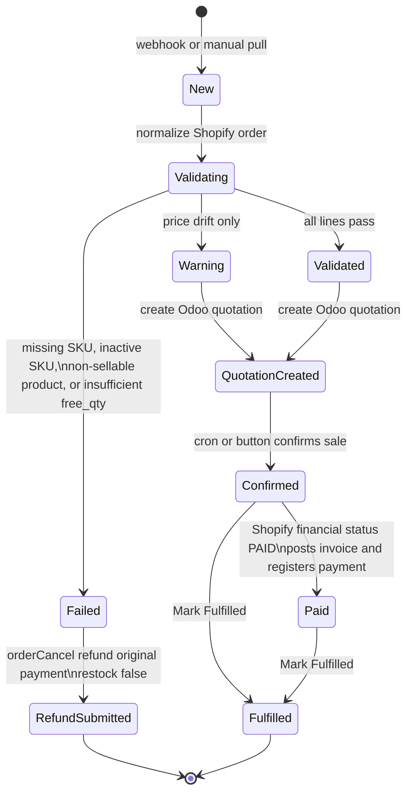
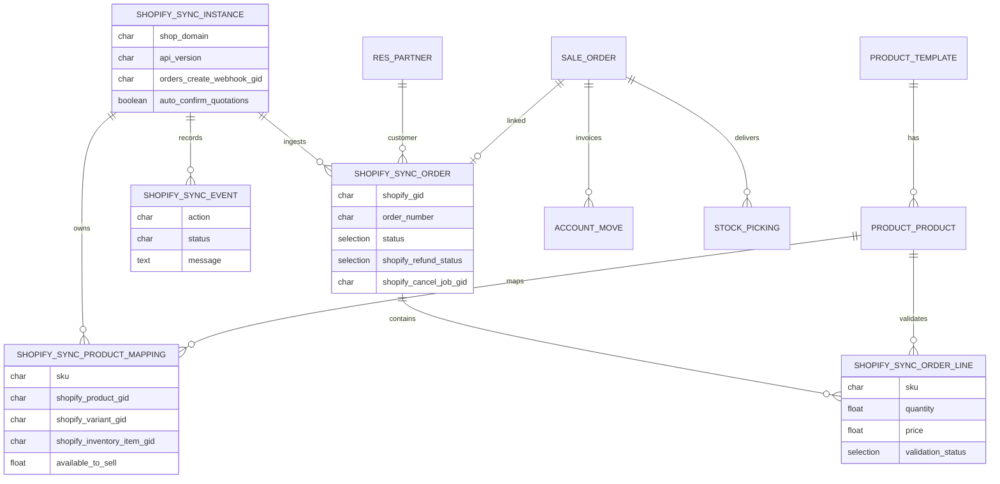
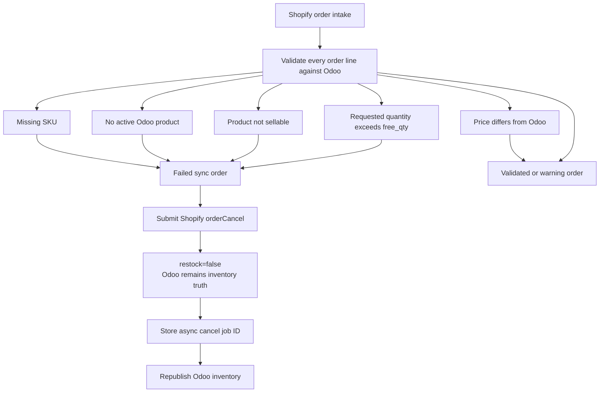
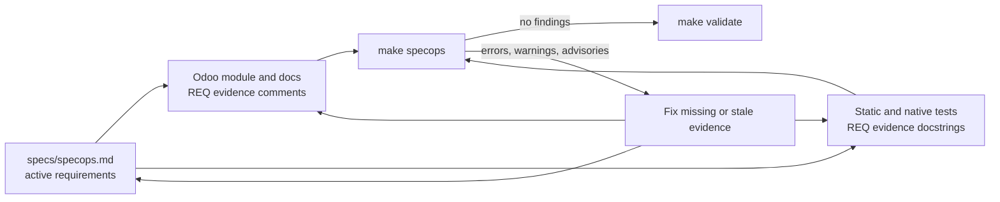

# Architecture And Workflow Diagrams

These Mermaid diagrams capture the maintained shape of the Odoo-led Shopify Sync
demo. They are written as Markdown so code review can catch changes alongside
SpecOps requirements.

SpecOps evidence: REQ-ODOO-001, REQ-CATALOG-001, REQ-ORDER-001,
REQ-REFUND-001, REQ-AUTO-001, REQ-FULFILL-001, REQ-MAINT-001.

## System Context

## Catalog And Inventory Publish

## Order Intake And Validation State

## Data Model

## Failure Handling

## SpecOps Maintenance Loop

